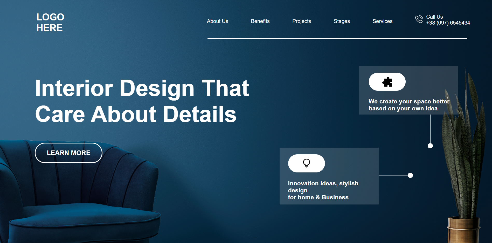

# Project 10 - HTML and CSS

By Piyush Bhatt

Deployed link of website &nbsp; 

 

# [Link to Project 10](https://interior-design-landingpage.vercel.app/)

 

# Preview of the Project.

 

## What I learnt in this Project?

- I learned about how to make modern website **layout**.
- I also learnt about how to create **background** with certain **opacity.**
- I also learnt create **lines and dots.**
- I also learnt to use **opacity and transparent property** for buttons.
- I also learned how to use **position property** effectively.

  

# Time Taken to complete  this project is 5 hour.